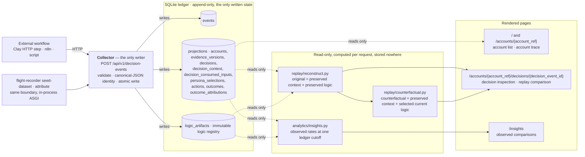
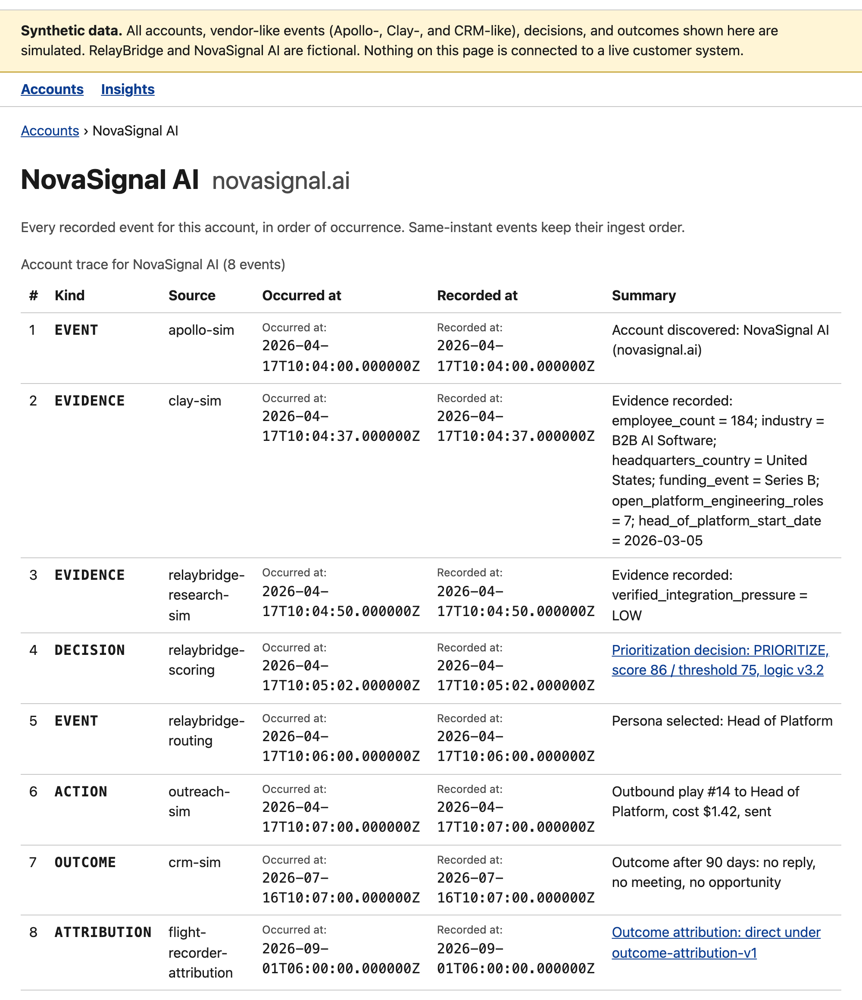
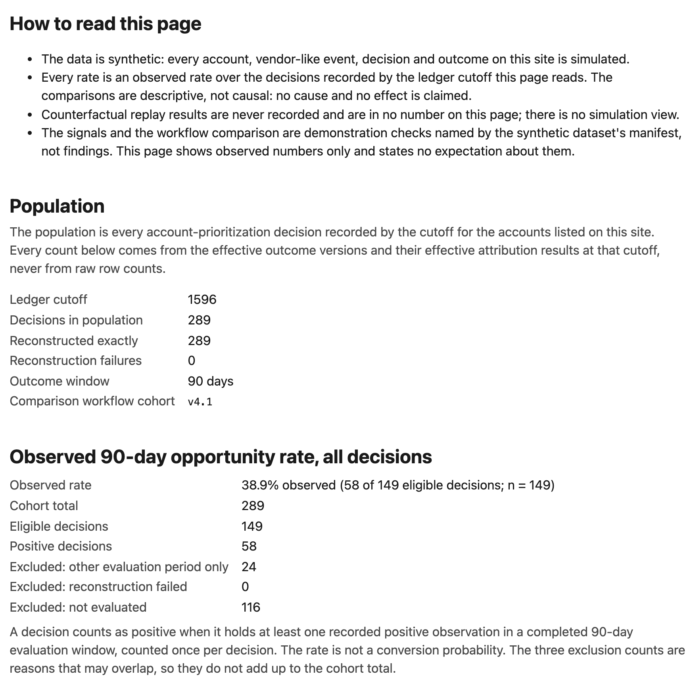

# GTM Flight Recorder

[](https://github.com/e-skora/flight-recorder/actions/workflows/ci.yml)

The badge reports the `ci` workflow on `main`, not any single job. That workflow runs three
jobs — `lint`, `tests` and `invariants` — and the `invariants` job runs
`uv run pytest -m invariant` with `HYPOTHESIS_PROFILE=ci`, on every push and pull request,
under no condition. GitHub builds status badges per workflow file rather than per job, so a
green badge means all three jobs passed; it is not a badge for the invariant suite alone.

## The problem

A modern revenue stack can discover, enrich, score, route and contact accounts, and it mostly
preserves two things: the current value of each field, and the actions it completed. When a
prioritization decision looks wrong three months later, that is not enough to explain it. You
cannot reliably recover which evidence was available at the moment of the decision, which of
that evidence the logic actually consumed, which version of the logic ran, what it scored,
what action followed, what the outcome was, or whether today's logic would decide differently
from the same historical evidence.

The reason is hindsight contamination. Fields have been overwritten since. The workflow has
been edited since. Outcomes arrived after the fact. So the record you can reach today is not
the record the decision was made from, and every after-the-fact explanation is quietly
reading present-day data back into the past.

## Thesis

**The category, broadly: observability for automated revenue decisions.** Once GTM software
starts making decisions rather than merely executing instructions, the people who own that
automation need a way to inspect, replay and debug the decisions it made.

**This MVP, precisely: it fully replays the account-prioritization decision class.** One
decision class — `PRIORITIZE` or `DO_NOT_PRIORITIZE` — is implemented end to end: preserved
historical context, consumed inputs, immutable logic identity, exact reconstruction,
counterfactual comparison under current logic, downstream action and cost, later outcome
under an explicit attribution policy, and event-derived aggregate comparisons. No other scope
is claimed.

## Synthetic data

All of the data here is simulated:

- Apollo-, Clay-, CRM- and outcome-like events are **simulated**, not received from a vendor.
- **RelayBridge**, the operating company whose workflow records the decisions, is fictional.
- **NovaSignal AI**, the canonical prospect, is fictional. So is every other account in the
  ledger, and so is every decision, action and outcome recorded against them.
- Nothing is connected to a live customer system. No live vendor integrations exist, and the
  demo needs no credential of any kind.

The application says the same thing on every page, in a disclosure banner above the content.

## Reference archetype

**Merge** is cited only as public evidence that the operating archetype exists, and this
establishes neither a customer relationship nor an unmet need.

## Architecture

Python 3.13, FastAPI with Pydantic v2 for envelope validation, Jinja2 server-rendered pages,
SQLite through SQLAlchemy 2.0, pytest with Hypothesis, ruff. No JavaScript framework, no
bundler, one process, one database file.

Every write in the system enters through one versioned collector endpoint. Replay and
analytics are read-only: they never write, and they never reach outside the preserved record.



## Replay semantics

Four rules do the work.

**The context is sealed at the decision boundary.** Each decision records an explicit
boundary instant and the values and availability states that were present to the decision
system at that instant. Evidence whose availability time falls after the boundary is not in
that context and never enters a replay, even when it describes something that happened
earlier in the real world. A correction appends a new evidence version; the version preserved
for the earlier decision still resolves to its original value and provenance.

**Reconstruction is exact or it fails by name.** A version label is metadata, not identity.
Scoring logic is stored as an immutable declarative artifact — factors, weights,
missing-value behavior, threshold, output mapping, artifact schema version, evaluator
version, canonical content hash — and the hash and evaluator identity are verified before any
evaluation runs. A missing, mismatched or ungrammatical artifact produces a named integrity
failure on the page. It never falls back to a best-effort result presented as exact.

**The counterfactual is computed on demand and never recorded.** The only two questions
replay answers are *preserved context + preserved logic* (the original) and *preserved
context + selected current logic* (the counterfactual). No table, column, event or cache
holds a counterfactual result, it never overwrites the original, and it never appears as
something that happened.

**Evidence recorded after the boundary enters neither.** Not the reconstruction, not the
counterfactual. Current logic may consume a historical signal the earlier logic ignored —
that is the interesting case — but it reads that signal from the preserved context, never
from today's account state.

The canonical scenario carries three fixture logic identities. `v3.2` is the logic that ran.
`v5.1` was the demo's default replay logic and is preserved as a historical artifact: it adds
a negative factor for low verified integration pressure, evidence that was available at the
boundary and that `v3.2` ignored. `v5.2` is the demo default now: it replaces that negative
factor with a positive one for high integration pressure, so it can produce either output.
All three are immutable. Registering `v5.2` edited nothing and retired nothing, and `v5.1`
stays selectable by its exact hash. Every weight in all three is a synthetic demonstration
choice, not a business rule.

`v5.2` lives in `fixtures/current/` rather than `fixtures/canonical/`, and is registered by
its own command. The canonical nine envelopes are closed and unchanged.

### Canonical decision facts

Every value in this table is read from `fixtures/canonical/`, which is the one source for
these constants across payloads, pages, tests and screenshots.

| Fact | Value |
| --- | --- |
| Decision boundary | `2026-04-17T10:05:02Z` |
| Employees, preserved at the boundary | `184` |
| Workflow version | `v4.2` |
| Threshold | `75` |
| Outbound play | `#14` |
| Recorded synthetic cost | `$1.42 USD` |
| Outcome evaluation window | `90 days` |

Two further preserved facts, derived from the same fixtures against that boundary: the Series
B funding event was observed 18 days earlier, and the Head of Platform started 43 days
earlier. The canonical decision records no confidence value, and the page says so rather than
inventing a percentage.

### The replay comparison, as the page renders it

The canonical decision page computes this comparison on every request and records none of it.
It uses the demo default, `v5.2`. Selecting the preserved `v5.1` by hash instead still gives
counterfactual score `51` and delta `-35`, unchanged.

| Field | Value |
| --- | --- |
| Original score | `86` |
| Counterfactual score | `72` |
| Score delta | `-14` |
| Original threshold | `75` |
| Counterfactual threshold | `75` |
| Original output | `PRIORITIZE` |
| Counterfactual output | `DO_NOT_PRIORITIZE` |
| Output changed | `output changed: yes` |

## Submitting a decision to the collector

One versioned ingestion boundary: `POST /api/v1/decision-events`, with
`Content-Type: application/json`.

**Live schema surfaces.** With the server running, the interactive docs are at
[`/docs`](http://127.0.0.1:8000/docs) and the OpenAPI document at
[`/openapi.json`](http://127.0.0.1:8000/openapi.json); ReDoc at
[`/redoc`](http://127.0.0.1:8000/redoc) serves the same schema. The envelope models
themselves live in `src/flight_recorder/collector/schema.py`, which is the source those
surfaces are generated from.

**The contract, as it stands today.** Each envelope carries `schema_version` — currently the
string `"1"` for `decision.recorded` — a caller-stable `event_id`, an `event_type`, a
`source`, an `account_ref`, timezone-aware `occurred_at` and `recorded_at`, and a typed
`payload`. Naive timestamps are refused. Identity is canonical-JSON identity: a retry that is
canonically identical, including reordered keys or different indentation, answers `200` with
status `duplicate` and has no second effect, while reusing the same `event_id` with different
canonical content answers `409` with status `conflict` and the two hashes. An envelope that
fails validation answers `422` with status `rejected`, a named reason and the field errors,
and writes nothing — no partial domain record is left behind.

**The complete envelope.** This is `fixtures/canonical/04-decision-recorded.json`, inline and
unmodified. Send exactly this body to `POST /api/v1/decision-events` with
`Content-Type: application/json`.

```json
{
  "schema_version": "1",
  "event_id": "evt-novasignal-04-decision-recorded",
  "event_type": "decision.recorded",
  "source": "relaybridge-scoring",
  "account_ref": "novasignal-ai",
  "occurred_at": "2026-04-17T10:05:02Z",
  "recorded_at": "2026-04-17T10:05:02Z",
  "payload": {
    "decision_class": "account_prioritization",
    "decision_boundary": "2026-04-17T10:05:02Z",
    "workflow_version": "v4.2",
    "historical_context": [
      {
        "input_key": "employee_count",
        "value": 184,
        "availability": "available",
        "evidence_version_id": "ev-novasignal-employee-count-v1"
      },
      {
        "input_key": "industry",
        "value": "B2B AI Software",
        "availability": "available",
        "evidence_version_id": "ev-novasignal-industry-v1"
      },
      {
        "input_key": "headquarters_country",
        "value": "United States",
        "availability": "available",
        "evidence_version_id": "ev-novasignal-headquarters-country-v1"
      },
      {
        "input_key": "funding_event",
        "value": "Series B",
        "availability": "available",
        "evidence_version_id": "ev-novasignal-funding-event-v1"
      },
      {
        "input_key": "open_platform_engineering_roles",
        "value": 7,
        "availability": "available",
        "evidence_version_id": "ev-novasignal-open-platform-engineering-roles-v1"
      },
      {
        "input_key": "head_of_platform_start_date",
        "value": "2026-03-05",
        "availability": "available",
        "evidence_version_id": "ev-novasignal-head-of-platform-start-date-v1"
      },
      {
        "input_key": "verified_integration_pressure",
        "value": "LOW",
        "availability": "available",
        "evidence_version_id": "ev-novasignal-verified-integration-pressure-v1"
      },
      {
        "input_key": "website_intent",
        "value": null,
        "availability": "unavailable"
      }
    ],
    "consumed_inputs": [
      {
        "input_key": "employee_count",
        "value": 184,
        "evidence_version_id": "ev-novasignal-employee-count-v1",
        "contribution": 25
      },
      {
        "input_key": "industry",
        "value": "B2B AI Software",
        "evidence_version_id": "ev-novasignal-industry-v1",
        "contribution": 20
      },
      {
        "input_key": "funding_event",
        "value": "Series B",
        "evidence_version_id": "ev-novasignal-funding-event-v1",
        "contribution": 18
      },
      {
        "input_key": "open_platform_engineering_roles",
        "value": 7,
        "evidence_version_id": "ev-novasignal-open-platform-engineering-roles-v1",
        "contribution": 15
      },
      {
        "input_key": "headquarters_country",
        "value": "United States",
        "evidence_version_id": "ev-novasignal-headquarters-country-v1",
        "contribution": 8
      }
    ],
    "logic_artifact": {
      "logic_version": "v3.2",
      "artifact_id": "logic-account-prioritization-v3.2",
      "artifact_hash": "db3a8bdebf2befe286ab49a2381dfe6fb931ac6f848923d35e0e732adcc82db0",
      "evaluator_version": "evaluator-v1"
    },
    "result": {
      "score": 86,
      "threshold": 75,
      "output": "PRIORITIZE"
    },
    "explanation": "Explanation: v3.2 matched the employee range, B2B AI Software vertical, recent Series B funding, platform-engineering hiring, and US headquarters for a score of 86 against a threshold of 75. Verified integration pressure was available but not consumed by v3.2."
  }
}
```

**Its prerequisites.** The collector refuses a decision whose references it cannot resolve, so
three things must already exist before this body is accepted:

1. the account, through an `account.discovered` event for `novasignal-ai`;
2. every `evidence_version_id` the envelope names, through `evidence.recorded` events for the
   same account, each with an availability time at or before `decision_boundary` and with a
   value and type matching this envelope exactly;
3. the logic artifact named by `artifact_hash`, through a `logic_artifact.registered` event.

**What it answers against the seeded demo.** Against the fully seeded demo database built by
`flight-recorder seed-dataset`, this exact event is **an idempotent duplicate and answers
`200`, not a creation**, because the seed already recorded it through this same boundary. That
is the correct behavior, not a failure: if you paste this body into a request against the demo
database, `200 duplicate` is what you should see. To watch it be created, submit it against a
ledger that holds its three prerequisites and not the event itself.

**Adapting it to a workflow step.** [`fixtures/examples/clay-http-step.json`](fixtures/examples/clay-http-step.json)
shows the same envelope shaped as a Clay HTTP-API step or an n8n HTTP Request node, with the
method, URL, headers and body laid out and the retry semantics noted. It is illustrative and
**not runnable unchanged**: its `{{row_id}}` and `{{run_id}}` placeholders are deliberately
left visible, its `artifact_hash` is all zeroes, and its account and evidence references are
placeholders. Replace all four with real values from your own ledger.

## Setup

Prerequisites: [`uv`](https://docs.astral.sh/uv/), and the Python version pinned in
`.python-version` (3.13), which `uv` will fetch for you.

From the repository root, on a clean checkout:

```
uv sync
uv run flight-recorder reset
uv run flight-recorder seed-dataset
uv run flight-recorder register-current-logic
uv run flight-recorder serve
```

Then open <http://127.0.0.1:8000/>.

**Run those four in that order.** `seed-dataset` submits the canonical NovaSignal AI trace
and the full synthetic dataset through the collector and attributes the outcomes;
`register-current-logic` then adds the `v5.2` artifact the replay panel defaults to. The
separate `seed` command builds only the canonical nine envelopes and is **not** the demo seed.

**Why the order matters.** The dataset is submitted against a fixed schedule, and the
collector refuses to load it into a ledger that already holds an event the schedule does not
expect at that position. Registering `v5.2` first therefore makes the next `seed-dataset`
stop with `ScheduleDiverged` and load nothing. Always seed the dataset first.

A canonical-only demo is also possible:

```
uv run flight-recorder reset
uv run flight-recorder seed
uv run flight-recorder register-current-logic
```

That gives the nine canonical envelopes and the `v5.2` artifact, with no generated dataset:
Insights is then populated by the one canonical recorded decision and nothing else.
**That database cannot afterwards be extended with
`seed-dataset`:** the overlay event already sits inside the schedule's prefix, so the load is
refused. To get the full demo, run `reset` and start again from `seed-dataset`.

**Mind the database path.** `--db` defaults to `$FLIGHT_RECORDER_DB` and falls back to
`./flight_recorder.db` — and `reset` **deletes that file**. If `FLIGHT_RECORDER_DB` is already
set in your shell, `reset` will delete whatever it points at. Either clear it, or scope this
run explicitly:

```
FLIGHT_RECORDER_DB=/tmp/flight-recorder-demo.db uv run flight-recorder reset
```

passing the same variable, or `--db`, to every command in the sequence.

## The demo path

Eight steps over the shipped seed. It is ready to record in 60 to 90 seconds; a recording is
optional and lives outside this repository.

| Step | What you say | Destination | Expected visible cue |
| --- | --- | --- | --- |
| 1 | The account list: 241 synthetic accounts, with the canonical demo prospect pinned at the top. | `/` | `Canonical demo account: NovaSignal AI` |
| 2 | Its whole trace: discovery, evidence, decision, persona, action, outcome, attribution. | `/accounts/novasignal-ai` | `Account trace for NovaSignal AI (8 events)` |
| 3 | The decision scored 86 against threshold 75 and output `PRIORITIZE` under `v3.2`, identified by artifact hash, not by label. | `/accounts/novasignal-ai/decisions/evt-novasignal-04-decision-recorded` | `score 86 / threshold 75` |
| 4 | The context preserved at the boundary, with provenance per input: five consumed, integration pressure available and ignored, one unavailable. | `/accounts/novasignal-ai/decisions/evt-novasignal-04-decision-recorded#evidence-context` | `available but ignored` |
| 5 | Downstream: play `#14` to the Head of Platform, cost `$1.42`, a negative 90-day outcome, attributed `direct` under a named policy. | `/accounts/novasignal-ai/decisions/evt-novasignal-04-decision-recorded#outcome-evt-novasignal-07-outcome-evaluated` | `opportunity: no (recorded negative observation)` |
| 6 | Across the dataset: funding barely moves the observed rate, integration pressure moves it a lot, `v4.2` sits below its cohort. Descriptive, not causal. | `/insights` | `38.9% observed (58 of 149 eligible decisions; n = 149)` |
| 7 | Current logic `v5.2` is in effect, resolved by label then used by hash. The preserved `v5.1` is still selectable, and the page says its weights cannot reach its threshold. | `/accounts/novasignal-ai/decisions/evt-novasignal-04-decision-recorded#current-logic-selector` | `In effect: logic version v5.2` |
| 8 | The same preserved context under `v5.2`: 86 becomes 72, output flips to `DO_NOT_PRIORITIZE`. No present-day evidence entered; nothing stored. | `/accounts/novasignal-ai/decisions/evt-novasignal-04-decision-recorded#replay-comparison` | `output changed: yes` |

### What Insights shows at that cutoff

Observed and descriptive. The comparisons are not causal: these are counts and rates over
recorded synthetic decisions, with sample size shown, and no cause or effect is claimed.

| Field | Value |
| --- | --- |
| Observed 90-day opportunity rate, all decisions | `38.9% observed (58 of 149 eligible decisions; n = 149)` |
| recently_funded difference | `+1.5 percentage points` |
| verified_integration_pressure_high difference | `+32.6 percentage points` |
| Workflow compared | `v4.2` |
| Workflow compared against | `v4.1` |
| Workflow difference | `-21.4 percentage points` |

### Screenshots

Captured from the running application at commit `3e5123b3692fcd24cc7c62c359916a74ebac0f15`
over a fresh `seed-dataset` ledger. Everything in them is synthetic.






## Tradeoffs

- **SQLite and a single process.** One file, one uvicorn worker, no connection pool worth the
  name. It carries a weaker operational signal than Postgres would, and it made the
  append-only guards, the atomic multi-table writes and the deterministic seed easy to state
  and easy to test. Timezone handling is explicit at the Pydantic boundary because SQLite has
  no timezone-aware type.
- **No deployment and no hosted demo.** The setup above is the only way to run it. That keeps
  the repository free of hosting configuration and write guards, and it means a reader has to
  install something before they see it work.
- **Counterfactuals are never persisted.** Recomputing on every page load costs a
  reconstruction plus an evaluation per request. In exchange, there is no schema in which a
  counterfactual could be mistaken for something that occurred.
- **The evidence vocabulary is a closed set.** Schema v1 accepts seven typed evidence kinds
  and a closed rule grammar. An unknown rule shape is refused rather than interpreted
  loosely. Adding a kind or a rule shape means a new schema version, not a configuration
  change.
- **A synthetic dataset stands in for real traffic.** 241 accounts, deterministic from a
  seed, with three documented behaviors planted so the aggregate calculations can be checked
  against a manifest. They are demonstration checks, not market findings, and nothing here is
  evidence about real buyers.
- **Under the fixture weights, `v5.1` prioritizes nothing, and the application says so.** Its
  positive factors sum to 72 against a threshold of 75, so no context can reach that
  threshold and a successful evaluation under it can only output `DO_NOT_PRIORITIZE`.
  That is a stated historical property of a preserved artifact, not a defect and not
  something the product hides: wherever `v5.1` is shown, the page reports the total, the
  threshold and what they allow. `v5.1` was the demo default until `v5.2` replaced it; it was
  never edited, and it is still selectable.

  Read the reported figure as an upper bound rather than a proven maximum. It is the sum of
  an artifact's positive weights, and the rule grammar accepts rules no value can satisfy, so
  a weight can raise that sum without ever being reachable. The absence of the notice on some
  other artifact is therefore not evidence that its threshold can be reached.

  The weights in all three fixture artifacts are synthetic demonstration choices. They are
  not business rules, and nothing in the synthetic Insights results validates them.

## What is not built

Plain, user-visible limitations:

- **No deployment and no hosted demo.** You run it locally or not at all.
- **No rule editor in the product.** All three logic versions are fixtures registered through
  the collector. Changing scoring logic means registering a new artifact, not editing a form.
- **No authentication and no multi-tenancy.** The operating company is presentation context,
  not a tenant boundary. Anyone who can reach the port sees everything.
- **No live vendor integrations.** Nothing talks to Apollo, Clay, Salesforce, HubSpot or a
  sales-engagement tool, and no credential is accepted anywhere.
- **No outreach execution.** It records a simulated action; it does not execute autonomous
  outreach, generate email or manage sequences.
- **One replayable decision class.** Account prioritization only. Discovery, enrichment,
  persona selection, the action and the outcome appear in the trace but are not independently
  replayable.
- **No causal claims.** The aggregate comparisons are descriptive, not causal, and the
  synthetic dataset cannot support a causal reading of anything.
